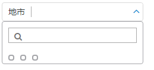

<rdk_title>第5步 实现第一个RDK服务并调用它 - RDK应用开发最佳实践</rdk_title>

## 目标与收获

本小节将为 `my_first_app` 添加地市条件的查询服务。通过本小节的学习，你将了解到

- 如何定制一个rest服务
- 如何查阅rest服务开发API函数手册
- 如何在页面中使用数据源调用rest服务，这是RDK一个重要工具
- 如何查询数据的手册

## 修改

地市的数据必须从后端查询得到，而不是写死在前端，本小节就来解决这个问题。

### 添加查询地市的rest服务

RDK的rest服务也是通过编写js代码实现，拷贝这个文件 `app/my_first_app/server/my_service.js`，命名副本文件名为citys.js

编辑 `app/my_first_app/server/citys.js` 文件：

~~~
(function() {

    return function(request, script) {
		//引入假数据，实际开发不可以引入
		require('$svr/mock_api.js');
		
		log('querying citys!');
        var m = matrix('select cityid, cityname from dim_comm_city');
		log('city result', m);
		return m;
    }

})();
~~~
这样我们实现了我们的第一个rest服务，一个查询地市的rest服务。

> 注意： 
> 为了绕开数据库，我们引入了mock_api.js文件来制造假数据，各位不需要关心这个文件的实现原理。[单击这里](mock_api.js)下载mock_api.js文件到server目录下。
> 
> **但是记住实际开发不可以引入它**！

打开浏览器，输入下面url可以调试它：

	http://localhost:8080/rdk/service/app/my_first_app/server/citys

一切正常的话，浏览器会打印出下面的内容

	{"result":"{\"header\":[\"cityid\",\"cityname\"],\"field\":[\"cityid\",\"cityname\"],\"data\":[[1,\"南京\"],[2,\"扬州\"],[3,\"苏州\"],[4,\"镇江\"]]}"}

格式很不友好，但是没关系，这些是原始数据，RDK会把他们转成一个优雅的json对象的。

注意到citys服务打印了一写日志 `log('querying citys!');` 这些日志写在了这个文件里了：`app/my_first_app/server/logs/log.txt`

~~~
2016-06-11 21:47:57,601 INFO [RunTimeHelper@my_first_app] - loading script: app/my_first_app/server/citys.js
2016-06-11 21:47:57,601 INFO [runtime_helper.js:195@citys.js] - loading script in js: app/my_first_app/server/mock_api.js 
2016-06-11 21:47:57,616 DEBUG [citys.js:7] - querying citys! 
2016-06-11 21:47:57,616 DEBUG [citys.js:9] - city result: {
  "header": ["cityid", "cityname"],
  "field": ["cityid", "cityname"],
  "data": [
    [1,"南京"],
    [2,"扬州"],
    [3,"苏州"],
    [4,"镇江"]
  ]
}  
~~~
最后一行就是我们调用`log()`打印的日志。日志是调试服务的一个重要的手段，所以一定要熟练使用，[这里详细描述了rdk提供的所有日志api](/doc/server/service_api.md#日志)。

> 提示
> 
> - `log()`函数可以接收任意数量的参数
> - `log()`函数可以接收任意类型的参数，它会尝试将其转为字符串。

### 查阅API函数手册
在实现citys服务的时候，我们用到了两个API函数，分别是[`log()`](/doc/server/service_api.md#日志)和[`matrix()`](/doc/server/service_api.md#matrix())，[这个页面](/doc/server/service_api.md)提供了所有RDK的所有API函数的说明。为了更好的使用它们，建议仔细阅读。

### 调用citys服务
citys服务是一个标准的restful服务，它可以被任意ajax请求调用。

下面我们来看看如何利用RDK的数据源组件调用它。编辑 `app/my_first_app/web/index.html`，修改后的rdk_basic_selector节点代码如下：
~~~
<rdk_basic_selector ds="dsCitys" ds_url="$svr/citys" ds_query_if="ready"
	multiple_select="true" label_field="name" track_item_by="id" editable="false">
</rdk_basic_selector>
~~~

主要是在rdk_basic_selector上添加了3个属性：`ds="dsCitys" ds_url="$svr/citys" ds_query_if="ready"`。这3个属性的作用是创建一个名为`dsCitys`的数据源，它指向的url是`$svr/citys`，并且在页面一准备好后立即发起查询，查询得到的数据直接提供给rdk_basic_selector。

但是这还不能让页面正常工作。

> 实践： 
> 此时刷新页面，看到的应该和下图差不多：
> 
> 

原因很简单，我们在[上一步](04_finish_condition_bar.md#city-mock-data)提供给[`BasicSelector`](/doc/client/controls/basicselector/rdk_basic_selector.md)的数据结构和[本文前面](#log)日志中输出的数据结构不一致导致了这个问题。

那么如何解决它呢？我们需要对rest服务查询得到的数据做转换。

在rdk_basic_selector节点添加另一个属性 `ds_data_processor="cityProcessor"`，它的作用是对服务端返回的数据做转换。它的值是scope上的一个函数。编辑main.js，在scope上添加一个名为cityProcessor的函数：
~~~
scope.cityProcessor = function(rawCitys) {
	var citys = [];
	angular.forEach(rawCitys.data, function(item) {
		citys.push({id: item[0], name: item[1]});
	});
	//必须把转换后的数据返回
	return citys;
}
~~~

> 实践： 
> 实际上，我们大可不必把转换的逻辑放在前端，我们在实现citys服务的时候，就可以在后端完成这个转换的逻辑，你可以改写citys服务，以避免在前端做数据转换。

到此，我们刷新页面后，就能看到和之前相同的效果了，唯一的差别是我们的地市数据是从rest访问查询而来的。

### 数据源手册
通过前一小节的实践，你已经学会了数据源的常规使用方法了，基本上能够满足大多数开发的需要了。[访问这里](/doc/client/common/datasource/)可以查阅数据源的其他用法，以及每个属性的详细说明。

### 删除不用的文件和代码

- 删除 main.js 中，`scope.citys` 变量
- 删除 server/my_service.js 文件
- 删除 server/mylib.js 文件

### 关于 $svr 宏
本文前面多次使用到 `$svr` 这个宏，[这里](/doc/server/relative_path_rule.md)有关于它的使用说明。

## 小结
我们实现了第一个RDK服务citys，并成功利用[数据源](/doc/client/common/datasource)调用这个服务，同时对数据做了一些转换。

你可以下载完成此步骤之后的[源码](05_first_service.zip)，解压到 `app/my_first_app` 下，[单击这里](/rdk/app/my_first_app/web/index.html)就可以打开它了。

