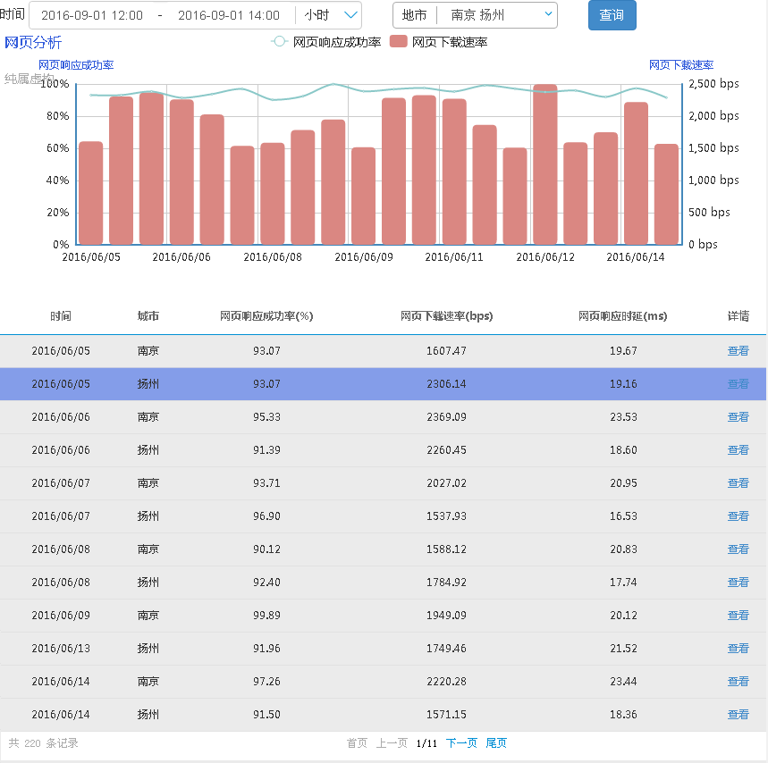

<rdk_title>天龙八步 - RDK应用开发新手宝典</rdk_title>

这个系列文章以一个应用从无到有，从简单到复杂的过程，一步步阐述如何基于RDK开发web应用，以及开发过程中可能会碰到的问题和解决方法。

隆重推荐每个RDK应用开发的新手都能仔细按照本系列文章一步步动手来开发这个应用。

- [前言 搭建开发环境](01_dev_env.md)
- [第1步 编写第一个应用](02_first_rdk_app.md)
- [第2步 使用第一个RDK控件](03_use_first_control.md)
- [第3步 完成查询条件栏](04_finish_condition_bar.md)
- [第4步 实现第一个RDK服务并调用它](05_first_service.md)
- [第5步 将查询得到的数据表格方式呈现](06_show_data_in_table.md)
- [第6步 将查询得到的数据以图形方式呈现](07_show_data_in_graph.md)
- [第7步 实现页面国际化](08_i18n.md)
- [第8步 优化详情对话框](09_detail_dialog.md)

先预览一下我们即将完成的应用吧：

