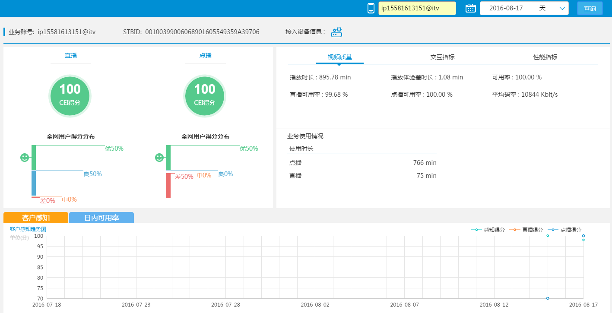

<rdk_title>rdk框架app开发指导手册</rdk_title>

## 背景

在VMAX项目RDK框架推动初期，虽然<a href="http://rdk.zte.com.cn/site/index.html" target="_blank">RDK官网</a>对RDK框架的使用有全面深入的介绍，以及<a href="http://10.9.233.35" target="_blank">e办</a>上有rdk控件demo，但是各团队面对一个全新的框架，从各个功能独立的控件demo到开发一个完整的具有复杂逻辑功能的app应用的时候，会遇到一些问题。本文档主要根据在使用RDK框架进行开发过程中遇到的问题，总结出相关的思路和方法，可供参考。

## 目的

本文档旨在指导了解过angularJs、rdk数据源、事件机制等相关知识基础上的开发人员进行完整app页面开发。rdk新手请<a href="http://rdk.zte.com.cn/doc/client/" target="_blank">点击</a>这里

## 实践操作

### 开发环境的搭建

安装nodejs，下载rdk应用包搭建本地rdk环境，详见[这里](/doc/#/manual.md)

### 范例app应用预览

### 前端部分

#### e办控件demo的使用

- <a href="http://10.9.233.35" target="_blank">e办首页</a>`http://10.9.233.35`

- 进入e办后登陆人事账号，点击菜单栏“规范”选项卡后可查看各个rdk控件demo的代码。

- demo运用

app开发直接复制html、css、js代码，因demo中控件是基于模板1.0进行开发的，现在已升级为2.0，因此需做相应修改：

> html头部需修改为：
~~~
<head>
    <meta http-equiv="Content-Type" content="text/html" charset="UTF-8" />
    <link rel="shortcut icon" href="favicon.ico" type="image/x-icon" />

    <title>RDK应用工程模板</title>
    
    <!-- fix-from -->
    <!--
        这个区域中的代码将被替换掉，请不要在这里添加任何有用代码
        fix-from 和 fix-to 是两个重要标志位，请勿改动
    -->

    <link rel="stylesheet" type="text/css" href="/rdk/app/libs/rdk/css/loading.css">
    

    <!-- 上面两行会被自动替换为下面两行 -->
    <!--
    <link rel="stylesheet" type="text/css" href="main.min.css">
    
    -->

    <!-- fix-to -->
</head>
~~~

> main.js需修改为：
>注：许多有用的注释这里删除掉了，完整注释代码文件请查看[这里](/rdk/app/example/web/index.html)
~~~
(function() {
    var downloadDependency = [
        // 所有路径中的 base 都会被替换成本页面html文件所在路径
        // 注意：所有的url都不能加 .js 扩展名
        'base/template/sample_module',

        // 带有 alias 属性的条目，可以通过 ctx.alias 的方式来访问到
        { url: 'base/scripts/utils', alias: 'utils' },
        { url: 'base/scripts/i18n',  alias: 'i18n'  },

        // css类型的文件需要加 css! 的前缀，注意url上不能加 .css 扩展名
        'css!base/css/style',

        // 这类 rd. 开头的条目是RDK预定义好的控件url别名
        'rd.controls.Module'
    ];
    var requiredComponents = [ ];
    // downloadDependency 中带有 alias 的条目的返回值会被保存在这个对象中
    // 可通过 ctx.alias 的方式引用到这些下载项的返回值
    var ctx = {};
    var controllerDefination = ['$scope', 'DataSourceService', 'EventService', main];
    function main(scope, DataSourceService, EventService) {
        // 应用内部初始化，一般不需要修改，也请保持这2行代码在main函数的最开始
        ctx.i18n.$init(scope);
        ctx.helper.initDataSourceService(DataSourceService);

        //=================== 在这里开始编写本应用的第一行代码 ========================
        

        //=================== 在这里结束本应用的最后一行代码 ========================
    };
    //==========================================================================
    //                 从这里开始的代码、注释请不要随意修改
    //==========================================================================
    
    require.config({paths:{helper: '/rdk/app/modules/rdk_app_helpers'}});
    downloadDependency.push({ url: 'blockUI', alias: 'blockUI' });
    downloadDependency.push({ url: 'helper', alias: 'helper' });
    define(/*fix-from*/application.getDownloads(downloadDependency)/*fix-to*/, start);
    function start() {
        application.initContext(ctx, arguments, downloadDependency);
        rdk.$injectDependency(application.getComponents(requiredComponents, downloadDependency));
        rdk.$ngModule.controller('RootController', controllerDefination);
        rdk.$ngModule.config(['blockUIConfig', function(blockUIConfig) {
            blockUIConfig.template = '
'
                + application.loadingImage + '
';
        }]);
    };
})();
~~~
主体逻辑代码部分复制到main.js提示位置即可。关于依赖注入，后面有详细介绍

> data文件为demo测试用的数据源文件，实际开发中需替换为后端服务文件

> main.js中的控件所需的依赖不要删除或者替换，除非对各依赖很熟悉

#### 应用rdk框架关键的js文件加载顺序

require.js -> rdk.js ->app-basic.js -> mainconfig.js -> angular.js -> jquery.js -> main.js -> 依赖注入js文件

>提示：rdk.js中事先注入了app-basic.js 、mainconfig.js、jquery、angular，因此jquery和angular中的方法可以直接使用。其中app-basic.js是rdk应用的基础文件，mainconfig.js是依赖注入的配置文件，main.js是app应用开发的入口文件。

#### 依赖注入

>应用的依赖

~~~
var downloadDependency=[
	// 所有路径中的 base 都会被替换成本页面html文件所在路径
    // 注意：所有的url都不能加 .js 扩展名
    'base/template/sample_module',
    // 带有 alias 属性的条目，可以通过 ctx.alias 的方式来访问到
    { url: 'base/scripts/utils', alias: 'utils' },
    { url: 'base/scripts/i18n',  alias: 'i18n'  },
    // css类型的文件需要加 css! 的前缀，注意url上不能加 .css 扩展名
    'css!base/css/style',
    // 这类 rd. 开头的条目是RDK预定义好的控件url别名
    'rd.controls.Module'
];
~~~

- 'base/template/sample_module'为app开发拆分的各个小模块，也可以是第三方插件

- { url: 'base/scripts/utils', alias: 'utils' }当需要使用所依赖文件的返回值时，需使用别名的方式注入，通过ctx.utils引用

- 'css!base/css/style'注入的css文件

- 'rd.controls.Module'注入的rdk封装的控件url别名

> 控制器的依赖

~~~
var controllerDefination = ['$scope', 'DataSourceService', 'EventService', main];
    function main(scope, DataSourceService, EventService) {
	......
}
~~~

注意到main函数的形参，可以发现形参顺序与依赖的顺序一致！requirejs不仅会下载依赖的文件，还可以把这些依赖返回的值传递给最后的那个函数。所以，如果你需要使用到依赖的文件返回的数据，则只要安排你的依赖的顺序和最后回调函数的参数顺序一致即可。

**提示：** 将关心返回值的依赖写在前面，不关心返回值的依赖排在最后

那么，该如何将demo中依赖注入部分转化为v2.0的版本呢？请看例子：

main.js(demo):

~~~
define('main', ['application', 'rd.controls.Graph','rd.services.EventService'], function(application) {
// 创建一个RDK的应用
var app = angular.module("rdk_app", ['rd.controls.Graph','rd.services.EventService']);
// 创建一个控制器
app.controller('rdk_ctrl', ['$scope', 'DataSourceService','EventService','Utils', function($scope, DataSourceService,EventService,Utils) {
application.initDataSourceService(DataSourceService);
/******************************************************
     将应用的代码逻辑添加在这个匿名函数内部
******************************************************/
}]);
}]);
~~~

v2.0:

~~~
(function() {
    var downloadDependency = [
        // 带有 alias 属性的条目，可以通过 ctx.alias 的方式来访问到
        { url: 'base/scripts/utils', alias: 'utils' },
        { url: 'base/scripts/i18n',  alias: 'i18n'  },

        // css类型的文件需要加 css! 的前缀，注意url上不能加 .css 扩展名
        'css!base/css/style',

        // 这类 rd. 开头的条目是RDK预定义好的控件url别名
        'rd.controls.Graph',
    ];
    var requiredComponents = [ ];
    var ctx = {};
    var controllerDefination = ['$scope', 'DataSourceService', 'EventService', main];
    function main(scope, DataSourceService, EventService) {
        // 应用内部初始化，一般不需要修改，也请保持这2行代码在main函数的最开始
        ctx.i18n.$init(scope);
        ctx.helper.initDataSourceService(DataSourceService);

        //=================== 在这里开始编写本应用的第一行代码 ========================
        

        //=================== 在这里结束本应用的最后一行代码 ========================
    };
    //==========================================================================
    //                 从这里开始的代码、注释请不要随意修改
    //==========================================================================
    	........
    };
})();
~~~

**注：** `'application'`无需再注入进去

#### 那么问题来了，如何增加自己的依赖呢？

因控件的依赖以及rdk相关的依赖在mainconfig.js中配置完成了，可直接在define函数的数组参数中引入别名即可。

那么当我们需要自定义某一个逻辑功能时，比如详表导出功能，举个例子：

> 注入我们的依赖

~~~
var downloadDependency = [
        // 带有 alias 属性的条目，可以通过 ctx.alias 的方式来访问到
        { url: 'base/scripts/tableOutput', alias: 'tableOutput' },
        ......
    ];
~~~

> 那么如何编写有返回值的依赖文件？

~~~
define([' rd.core'],function() {
    function outPutFile(param){
       ...
    }
    return {//返回一个对象
       outPut：function(param){
                     return outPutFile(param);
	     }
	}
    }
);
~~~

在已注入该依赖的js文件中就可以这样调用它的方法了：`ctx.tableOutput.outPut(param);`

#### 控制器(controller)之间的交互

- 数据源

控制发起数据查询的时机：`EventService.broadcast('ds_user', EventTypes.START_QUERY, condition);`

举个例子（当点击查询按钮时发起数据查询）

~~~
html:
<!DOCTYPE html>
<html>
<head>
	<title></title>
</head>
<body>

     <button ng-click="search()">查询</button>

    <rdk_graph ds="dsCustomPerception" ds_url="$svr/singleUserPer1Trend" 
    graph_define="scripts/singleUserPerception/graph_define/customPerceptionTrend.js" ></rdk_graph>

</body>
</html>

js:
define('main', ['rd.services.EventService'],function(EventService){
    var app = angular.module("rdk_app", ['...']);
    app.controller('Ctrl1',['$scope'],function(scope){
        scope.search=function(){
	EventService.broadcast('dsCustomPerception', EventTypes.START_QUERY, condition);
}
});
    app.controller('Ctrl2',['$scope'],function(scope){
        ...
});
})
~~~

**注意：** 如果在页面加载时不需要查询数据，rdk自定义指令的ds_query_if="ready"需删除！

***重要：*** 数据源的查询条件处理以及获得数据后的处理请参照rdk前端开发手册的[数据源部分](/doc/#client/common/datasource/DataSourceService.md)

- scope间的通信

重点介绍“同级作用域”之间的通信

> 作用域继承方式：父子级之间通信

>基于事件的方式：可实现同级作用域之间的通信

~~~
// $emit表示向父级以上的作用域传播事件
$scope.$emit('recall', data);
// $broadcast向子级以下的作用域广播事件
$scope.$broadcast('recall', data);
// $on表示监听事件
$scope.$on('recall', function(event, data) {});
~~~

首先我们一个兄弟控制中向父作用域触发一个事件，然后在父作用域中监听事件，再广播给子作用域，这样通过事件携带的参数，实现了数据经过父作用域，在兄弟作用域之间传播。这里要注意的是，通过父元素作为中介进行传递的话，兄弟元素用的事件名不能一样，否则会进入死循环。请看代码：

兄弟作用域之间传播：

~~~
var app=angular.module('myApp',[]);
app.controller('mainCtrl',[$scope],function($scope){
     $scope.$on('requestRecall', function(e,data) {
        $scope.$broadcast('executeRecall',data);
    });
})
app.controller('Ctrl1',[$scope],function($scope){
    $scope.name = "Jack";
    $scope.recall = function() {
        $scope.$emit('requestRecall', $scope.name);
    }
})
app.controller('Ctrl2',[$scope],function($scope){
    $scope.recall = function() {
        $scope.$on('executeRecall', function(e,data) { 
            alert(data);
        });
    }
})
// html

    

        
{{name}}

        <button ng-click="recall()"></button>
    

    

        
{{name}}

        <button ng-click="recall()"></button>
    

~~~

> angular服务的方式

~~~
angular.module('myApp', []).factory('instance', function(){
      return {};
});
~~~

在服务中生成一个对象，该对象就可以利用依赖注入的方式在所有的控制器中共享。

#### app模块化

大多时候，一个app应用不止一个前端开发人员，因此为了便于开发过程中进行调试，需要将app拆分成多个模块

~~~
var downloadDependency = [
        // 所有路径中的 base 都会被替换成本页面html文件所在路径
        // 注意：所有的url都不能加 .js 扩展名
        'base/template/sample_module1',
        'base/template/sample_module2',
	......
        // 这类 rd. 开头的条目是RDK预定义好的控件url别名
        'rd.controls.Module'
];
~~~

- main.js中注入各模块以及依赖`'rd.controls.Module'`

- 各模块文件需注意不同的控制器之间不能重名！

- 更多关于模块化的内容请访问：[module控件](/doc/#client/controls/module/module.md)

#### 前端测试以及前后端接口

> 前后端接口

~~~
<ANY ds="ds_user" ds_url="demo/user_list" ds_query_if="ready"></ANY> 
~~~

ds_url属性的值为后端服务文件的url

传参：（仅适合后端也采用rdk的方式，后端没用rdk的请用以前的传参方式）

前端：param={userId:"",date:""}

后端：

~~~
(function() {
    return function(request, script) {
	  request.userId="";
	  request.date="";
	  ...
	  return data;
}
});
~~~

> 前端测试

- 在web前端js中自定义所需数据进行测试

- 编写后端服务文件进行测试

后端服务文件代码如下：

~~~
(function() {
    return function(request, script) {
	  return {//返回需要的数据类型 推荐使用此结构返回
		    header:"",
		    field:"",
		    data:[[],[],....[]]
		}
}
});
~~~

### 后端部分

后端服务请查看（网站介绍比较详细）：[点击这里](/doc/#/server/service_api.md)

举个例子：

~~~
/*视频单用户饼图查询：入参：userid 业务账号，时间day.出参：一维数组result[直播qoe,点播qoe]*/
(function() {
    return function(request, script) {             
        var userid = request.userId;
        var day=request.day;
        var data1=[];
        var data2=[];
        var sql1="select cast(qoe as decimal(8,0)) as qoe from iptv_subject_stb_live_day where userid= '"+userid+"' and day= '"+day+"'";
        var sql2="select cast(qoe as decimal(8,0)) as qoe from iptv_subject_stb_vod_day where userid= '"+userid+"' and day= '"+day+"'";
       var tempVales1=matrix(sql1);
       var tempVales2=matrix(sql2);
       if (tempVales1.data == null || tempVales1.data.length == 0 || tempVales1.data == "null"){
           data1[0]="null";  
       }else{
           data1[0]=tempVales1.data[0][0];
       }
       if (tempVales2.data == null || tempVales2.data.length == 0 || tempVales2.data == "null"){
          data2[0]="null";  
       }else{
          data2[0]=tempVales2.data[0][0];
       }
       var resultmap={};
       resultmap.data=[data1[0],data2[0]];          
       return resultmap;
    }
})();
~~~

**提示：** `matrix(sql)`函数为工程模板v1.0的api，最新的v2.0版本可用`Data.fetch(sql)`进行替换

