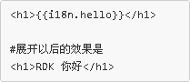
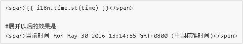

## 二次开发 {#edit}

在应用的scripts目录下，找到i18n.js文件，编辑它：

	define(['rd.modules.i18n'], function(i18n) {
	    var labels = {
	        "en_US": {
	            hello: 'Hello RDK',
	            ready: 'Your RDK application is ready!',
	        },
	        "zh_CN": {
	            hello: 'RDK 你好',
	            ready: '你的 RDK 应用可以正常工作了！',
	        }
	    }

	    //应用的当前语言环境从浏览器中取
		//需要自定义语言，请查看文档 /doc/common/i18n/index.html
	    var lang = getLocalLanguage();
	    return i18n.init(labels, lang);
	    
	    function getLocalLanguage() {
	        var language = window.navigator.language; 
	        if (!language) {
	            language = window.navigator.browserLanguage; 
	        }
			return language.replace('-', '_');
	    }
	});

在 `labels` 对象中添加自己的国际化标签。

注意到上述代码把当前语言环境写死了，在实际使用过程中，当前的语言环境往往是需要通过一些途径去获取的，[这里提供了一些建议](#get_lang)。

### 静态国际化标签 ###

静态国际化标签，顾名思义就是内容固定的国际化标签，如下：

	"zh_CN": {
		ready: '你的 RDK 应用可以正常工作了！'
	}

### 动态国际化标签 ###

动态国际化标签是指标签内容可变的：

	"zh_CN": {
		select: '选中了 {0} 个对象'
	}

选中的对象个数是动态的，在应用运行时才能确定。动态变量的个数可以有多个，使用 `{n}` 的方式编写，n是一个整数，从0开始以1的步长递增。

## 使用国际化标签 ##

例子：
<live_demo example="common/i18n/" width="800"></live_demo>

### 在HTML中使用 ###

对于普通的区域，可以使用下面的方式来使用国际化标签：

双花括号是一种AngularJS的表达式。其中 `i18n` 是不变的，`hello` 是[二次开发](#edit)中提到的 `labels` 变量的一个属性。

对于动态国际化标签，可以通过下面方法使用：

**注意**，这里的 `time` 必须是scope是上的属性！请参考[这个例子的源码](/demo/live_demo/?common/i18n/)。

### 在HTML中使用（双向绑定） ###

在支持双向绑定的属性上使用国际化不需要加双花括号：

	# ng_bind 支持双向绑定，因此不需要使用双花括号
	<h1 ng_bind="i18n.select.st(10)"></h1>

	#展开以后的效果是
	<h1>选中了 10 个对象</h1>

那么，在实际开发过程中，**如何判定一个属性是否支持双向绑定呢**？查看文档当然是一个很好的途径。

这里提供另一个更方便的途径：无论什么属性，都先用双花括号包围，如果控制台不报错，那就不改，如果控制台报类似下面的错误，则把双花括号去掉：

	Error: [$parse:lexerr] Lexer Error: Unexpected next character
	  at columns 0-0 [选] in expression [选中了 10 个对象].

### 在JS文件中使用 ###

在JS文件中使用国际化标签，和在HTML中类似，使用下面的代码：

	#获得一个静态标签
	var helloLabel = i18n.hello; //RDK 你好

	#获得一个动态标签
	var selectLabel = i18n.select.st(10); //选中了 10 个对象

## 获取语言环境 {#get_lang}

### 通过服务获取 ###

假设应用的语言环境是通过一个rest服务请求获取到的，在这样的情况下，需要对i18n.js文件做一些改造，假设请求语言的rest服务的url为 `/common/locale`，需要把i18n.js代码改为：

	define(['rd.modules.i18n', 'rest!/common/locale'], function(i18n, lang) {	    
	    var labels = {
			。。。
	    }
	    return i18n.init(labels, lang);
	});

`rest!/common/locale` 这个配置信息告诉RDK自动发起rest请求去获取当前语言环境。

### 通过js获取 ###

有时候当前的语言环境在其他js文件中提供，比如 `/common/locale.js` 这个js文件运行后，会把当前语言环境写入到一个全局变量叫 `curLang`，需要把i18n.js代码改为：

	define(['rd.modules.i18n', '/common/locale.js'], function(i18n) {	    
	    var labels = {
			。。。
	    }
	    return i18n.init(labels, curLang);
	});

### 通过本地变量获取 ###

少数情况下，会把当前语言环境配置在前端，在这个情况下，只能将当前的语言存放在一个全局变量下，比如 `window`，以让rdk能够访问到它：

	define(['rd.modules.i18n'], function(i18n) {	    
	    var labels = {
			。。。
	    }
	    return i18n.init(labels, window.myLang);
	});

----

<rdk_title>国际化</rdk_title>