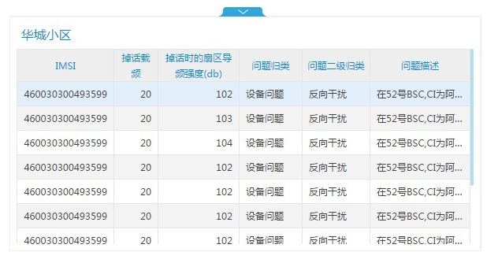
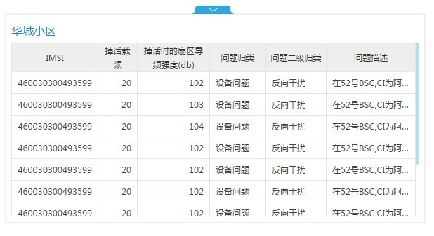
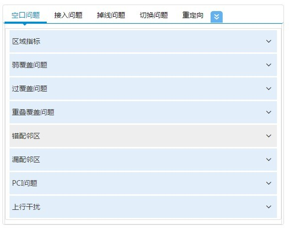
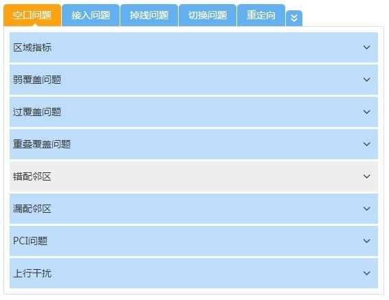
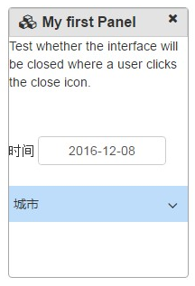
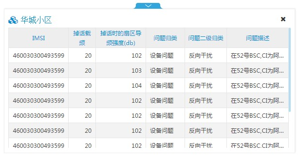

<rdk_title>theme</rdk_title>

##RDK主题控制

# 实现方式 #
通过更换css来实现更换主题。

# 简介 #
对于同一个控件具有多种不同的风格主题，可以通过这个rdk-theme属性选择不同的主题风格。

这是一个简单的 `rdk-theme` 例子：

<live_demo example="common/theme/themeTable" width="900"></live_demo>

# 目前可配置rdk-theme属性的控件 #

## tabler 控件可用主题 ##

- 默认主题，不使用属性
- rdk-table-theme-gray

上面主题分别如下：

事例代码：

	<rdk_table ……></rdk_table>

效果如右图：
	

事例代码：

	<rdk_table rdk_theme="rdk-table-theme-gray" ……></rdk_table>

效果如右图：
	

## tab 控件可用主题 ##

- 默认主题，不使用属性
- rdk-tab-theme-blue

上面主题分别如下：

事例代码：

	<rdk_tab  ……></rdk_tab>

效果如右图：
	
	
事例代码：

	<rdk_tab rdk_theme="rdk-tab-theme-blue" ……></rdk_tab>
	
效果如右图：
	

## panel 控件可用主题 ##

-默认主题，不使用属性
-rdk-panel-theme-blue

上面主题分别如下：

事例代码：

	<rdk_panel  ……></rdk_panel>

效果如右图：
	

事例代码：

	<rdk_panel rdk_theme="rdk-panel-theme-default" ……></rdk_panel>
	
效果如右图：
	

