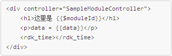

<rdk_title>Module</rdk_title>

# 简介 #
`rdk_module` 主要使用在如下两个场景：

1. 多人协同开发。复杂app往往需要多人一起协同开发，可以将app拆开为若干个`rdk_module`，然后分给不同的队员开发，最后组装成一个app。
2. 雷同功能的复用。可以将一些常用的功能适当包装成一个 `rdk_module`，并在多个app中复用。比如：
	- 多数app都有查询条件栏，一般是一个时间框+一个地市选择框，将这个常用的条件栏包装成一个`rdk_module`，就可以直接用到多个app上，而无需每个页面都去开发相同的条件查询栏。
	- 多数展示数据的app都采用左边饼图为概要信息，右侧表格/柱状图为详情，并实现左右两边联动，这样的功能也可以包装为`rdk_module`在多页面中复用。

基本用法如下

    <rdk_module url="xx/yy.html"></rdk_module>

# 属性 #

## `id` ##
> 支持类型：字符串，可选。

模块的唯一性标识

<live_demo example="controls/module/module_id" width="900"></live_demo>

## `url` ##
> 支持类型：字符串，可选。

模板url。一个模板实际上就是一个html片段。下面是一个简单的html模板：

模板中使用的所有变量的上下文scope取决于 controller 属性的值。

## `controller`  ##
> 支持类型：字符串，可选。

用于设置当前模块所使用的控制器，如果未提供有效控制器，则RDK会给出一个默认的控制器。

控制器的作用是

- 用来存放模板中的变量；
- 用来定义对外的函数、变量；

控制器非常有用，它可以给模板创建一个隔离的作用域。我们可以把与模板相关的业务逻辑都编写在这个隔离的作用域中，这样可以实现高度内聚的模块，这样我们可以更好的维护代码。

模板中的变量优先从本控制器的作用域中获取，如果在本作用域中找不到该变量，则会采用从上级作用域中的同名变量。

`rdk_module` 所在节点以及模板的根节点都可以有controller属性，RDK优先读取 `rdk_module` 所在节点的controller属性，再读取模板的根节点的controller属性。

## `init_data` ##
> 支持类型：json对象，可选。

指定模块的初始化数据，在定义可重复使用的模块的时候非常有用。在html中，可以提供一个json字符串或者一个scope上的属性名：

    <rdk_module url="sample_module.html"
        init_data="{data: 'defined in initData of module1'}">
	</rdk_module>

## `load_on_ready` ##
> 支持类型：布尔型，可选。

是否自动加载模块。

- 值为true时自动加载模块。默认值是true。
- 值为false时，需要手工加载模块。

## `load_timeout` ##
> 支持类型：数字。

加载模块相关文件的超时毫秒数。默认值是10000。

# 方法 #

## `loadModule()` ##
定义

	function(initData, url, controller, timeout);

参数说明：

- initData：一个json对象，可选。是模块的初始化数据，如果指定了控制器，则initData的各个属性都会被拷贝到控制器的scope上。默认取自`rdk_module`节点的init_data属性值。
- url：一个字符串，可选。打算加载的模块url。默认取自`rdk_module`节点的url属性值。
- controller：一个字符串，可选。编译模板时所采用的控制器，必须事先定义好。定义控制器的方法参考本文各个demo。默认取自`rdk_module`节点的controller属性值。
- timeout：一个数字，可选。加载模块的超时时间。默认取自`rdk_module`节点的load_timeout属性值。

返回值：无。

灵活使用这个方法可以非常灵活控制模块的加载，下面是一个基本用法的demo

<live_demo example="controls/module/simple_load" width="900"></live_demo>

给`rdk_module`节点定义一个id属性，值为`mymodule`，然后用这个代码就可以调用模块的方法了：

	var initData = {};
	rdk.mymodule.loadModule(initData);

修改传递给这个方法的参数，可以实现根据业务场景需要，动态加载一个模块的目的。参考下面的例子，稍微有些复杂，请确保已经理解了 loadModule() 的基本用法之后再继续：

<live_demo example="controls/module/complex_load" width="900" height="360"></live_demo>

## `destroyModule()` ##
定义

	function();

参数说明：无

返回值：无

利用这个方法可以销毁一个模块。当一个模块完成了它的作用之后，可以调用这个方法将其销毁，回收其所占用的资源。

下面是一个基本用法的demo
<live_demo example="controls/module/simple_load" width="900"></live_demo>

## `child`属性 {#child} ##

可以这样类比：controller属性的值是控制器的名字，相当于一个类，RDK在编译这个模块的模板的时候，会将这个类实例化出一个对象出来，并将这个对象用`child`属性来引用，因此`child`属性本质上是本模块的控制器的一个实例。

因此，通过`child`属性我们可以访问到本模块控制器上的所有方法和属性。

给`rdk_module`节点定义一个id属性，值为`mymodule`，然后用这个代码就可以调用`child`属性了：

	var initData = {};
	rdk.mymodule.child;

请参考下面这个demo的main.js中`scope.hello`函数的代码
<live_demo example="controls/module/basic" width="900"></live_demo>

# 事件 #

## EventTypes.LOADING ##

当模块开始加载时发出此事件。

## EventTypes.READY ##

当模块一切准备就绪时发出此事件。
<live_demo example="controls/module/simple_load" width="900"></live_demo>

## EventTypes.DESTROY ##

当模块被销毁之后发出此事件。
<live_demo example="controls/module/simple_load" width="900"></live_demo>