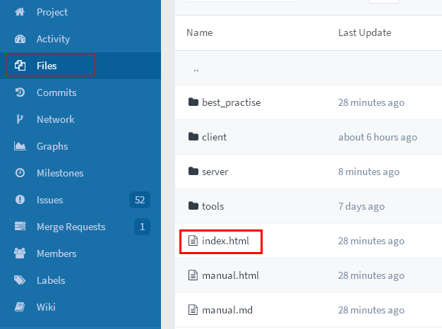
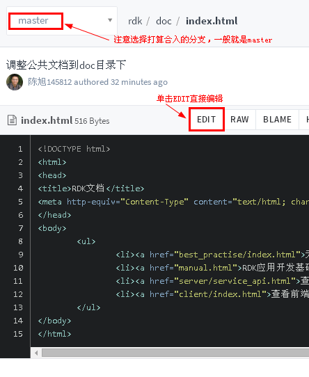
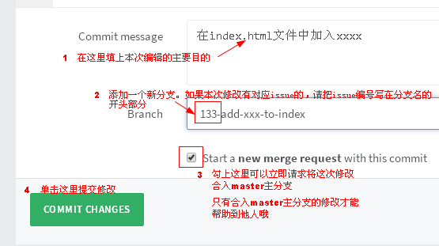
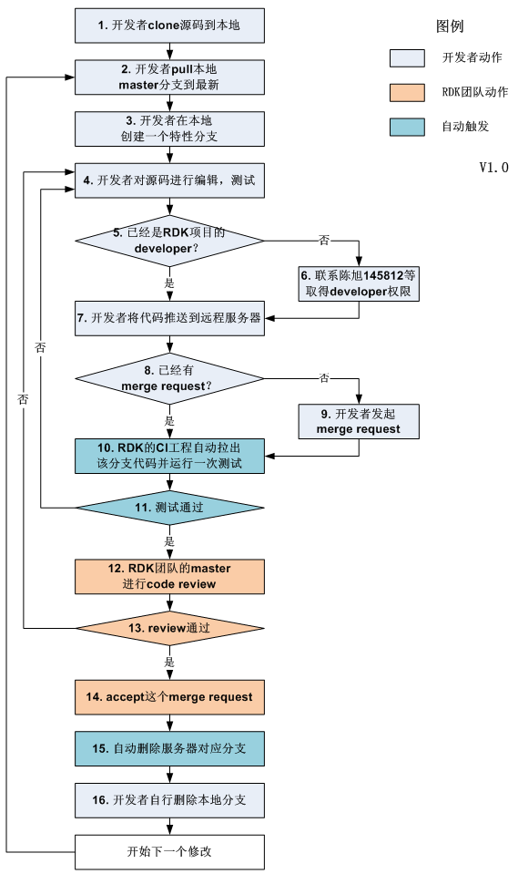
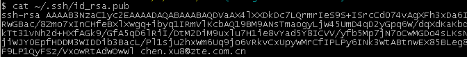
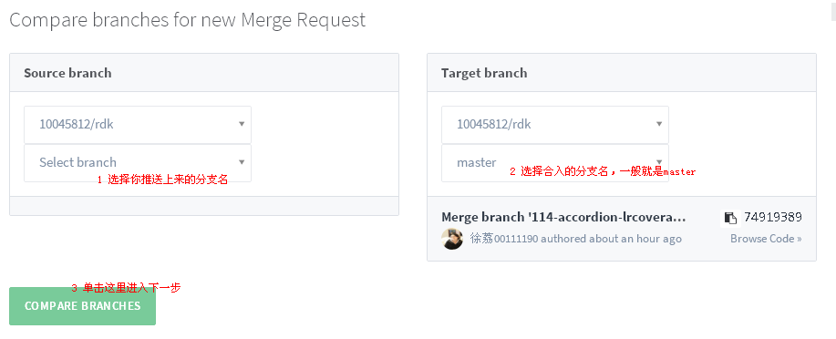

<rdk_title>参与RDK研发说明</rdk_title>

## 1分钟学会如何直接编辑文件 {#edit-online}

### 在Files中找到需要编辑的文件

### 开始编辑
选中目标文件之后，可以查看文件内容，单击右上角的EDIT按钮进入编辑状态：

如果EDIT按钮是灰色的，有两种可能：

1. 未登录。请用人事在线账号在[这里登录](http://gitlab.zte.com.cn/users/sign_in)。
2. 无权限。请给rdk开发团队的 `陈旭145812` 或 `徐荔00111190` 或 `顾姗6092001913` 发邮件，取得权限。发邮件之前请至少登录过一次。

### 提交编辑 {#commit-edition}

在编辑状态页面拉到最下方，可以看到下图：

## RDK的工作流 {#work-flow}
所有参与RDK的人都采用下面的流程来协同工作。

说明：

1. [发起merge request的详细操作说明](#merge-request)
2. [零git基础详细操作说明](#git-cmd-list)

## 我是git小白，需要详细的帮助 {#git-cmd-list}

### 安装
先按照这里的说明正确安装git：<http://wiki.zte.com.cn/pages/viewpage.action?pageId=20197085>

### 配置
配置是一次性的。

#### ssh-key
1. 运行git-bash，进去之后输入这个命令 `ssh-keygen -t rsa -C "myname@xxxx.com"`，所有问题都采用默认答案就行啦。
2. 输入`cat ~/.ssh/id_rsa.pub`，将这个命令的输出拷贝到剪切板备用。输出类似这样的：

3. 打开并登录[这个页面](http://gitlab.zte.com.cn/profile/keys)，单击右上角的ADD SSH KEY，把拷贝出来的粘贴到KEY框中，点击ADD KEY就可以了。

#### git config
1. 打开并登录[这个页面](http://gitlab.zte.com.cn/profile)，拷贝Email框中的邮箱。
2. 在git-bash中输入这个命令 `git config --global user.email "myname@xxxx.com"`，注意邮箱使用拷贝的值。
3. 再输入这个命令 `git config --global user.name "你的大名"`

### 日常使用

对应[RDK的工作流](#work-flow)的每一步，把使用到的git命令列举如下：

1. `git clone git@gitlab.zte.com.cn:10045812/rdk.git`
2. 顺序执行这些命令
	1. `cd rdk`
	2. `git checkout master`（可选）
	3. `git pull origin master`
3. `git checkout -b my-branch-name`
4. 代码编辑&测试过程中，可随时顺序执行这些命令
	1. `git add .`
	2. `git commit -m "提交说明。。。"`
5. 无
6. 无
7. `git push origin my-branch-name`，如果没有报错，代码就推送到服务器上啦。注意：虽然代码已经到服务器上，但是必须合入master分支才能生效，[这里有详细操作说明](#merge-request)。

最后想删除本地分支，则可顺序执行这些命令:

1. `git checkout master`
2. `git branch -d my-branch-name`

零git基础的同学最好严格按照顺序执行。`my-branch-name` 注意替换为实际分支名。

## 发起merge request {#merge-request}
master分支是一个非常重要的分支，一般不允许开发者直接合入，因此需要提交merge request，在RDK团队审核通过后，就可以自动合入master分支了。

开发者在取得RDK的developer权限之后，可以登录[这个页面](http://gitlab.zte.com.cn/10045812/rdk/merge_requests/new)发起merge request：

最后，填写合并的说明：

