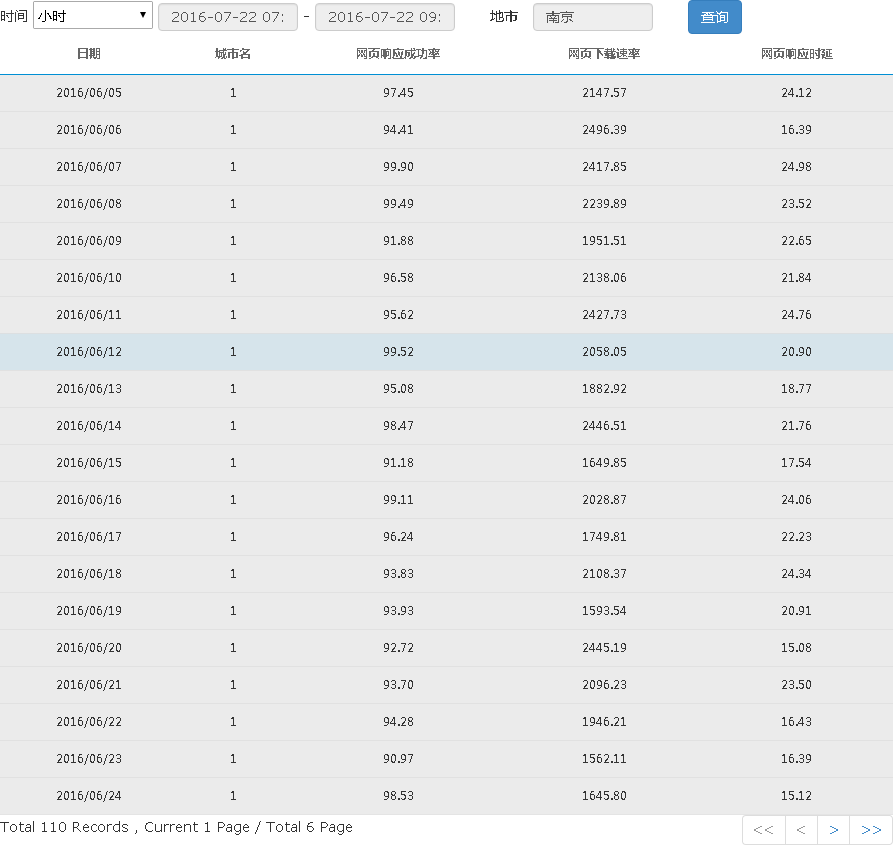

## 目标与收获

本小节将让 `my_first_app` 可以在表格中显示查询得到的数据。通过本小节的学习，你将了解到

- 实现一个查询数据服务
- 如何使用将数据呈现在表格中
- 如何实现表格的服务端分页

## 修改

通过绑定数据源的方式，实现数据在表格呈现并实现分页功能。本小节就来解决此问题。

### 实现查询数据服务
我们来实现第二个rest服务，和实现第一个服务的方法一样，拷贝任意一个能够正常工作的服务，比如citys.js，并重命名为 webAnalysis.js，代码如下
~~~
(function() {

    return function(request, script) {
		//引入假数据，实际开发不可以引入
		require('$svr/mock_api.js');
		
		//打印前端传过来的查询条件
		log(request);
		
		var tableUtil = require('app/common/server/util/tableUtil.js');
		var sql = 'select clttime,cityname,webrspsuccrate,webdownloadrate,webrspdelay ' +
			'from aggr_web_day_month_201607 ' +
			'where clttime between "' + request.beginTime + '" and "' + request.endTime +
			'" and city in (' + request.citys.join(',') + ')';
		
		var data = matrix(sql);
		data.header = ['日期', '城市名','网页响应成功率','网页下载速率','网页响应时延'];
		return data;
    }

})();

~~~
注意到前端传递过来的查询条件都存放在`request`变量中了。

> 提示： 
> 这个服务实现过程中，对实际情况做了很多简化，把实际开发过程中可能会碰到的很多问题的隐藏掉了，这些问题在后续的步骤中会一一提出并给出解决方法。

### 添加表格控件
编辑`app\my_first_app\web\index.html`文件，在body节点中添加：
~~~
<rdk_table ds="dsWebAnalysis" ds_url="$svr/webAnalysis" page_size="20">
</rdk_table>
~~~

这里引入了一个新的控件rdk_table，注意要使用[第三步的方法](03_use_first_control.html#dep-inject)注入表格的依赖。

在引入表格的时候同时创建了一个名为dsWebAnalysis的数据源，它指向前一小节实现的数据查询服务。

### 查询按钮响应查询
单击了查询按钮之后，我们会发起一次数据查询请求，在请求中带上当前的查询条件，包括

1. 开始结束时间
2. 选中的地市，为了能够获取到当前选中的地市，需要编辑页面，在rdk_basic_selector节点上添加一个属性：`selected_items="selectedCitys"` 即可。selectedCitys是scope上的一个属性。

下面开始给查询按钮添加单击响应动作，编辑页面，找到button节点，添加一个属性：`ng-click="search()"`，再编辑js代码，在scope上创建search函数，代码如下：
~~~
scope.search = function() {
	//由于服务端需要的是选中城市id列表，因此需要先处理一下选中的城市
	var citys = [];
	angular.forEach(scope.selectedCitys, function(city) {
		citys.push(city.id);
	});
	
	var ds = DSService.get('dsWebAnalysis');
	var condition = {
		beginTime: scope.timeSetting.value[0],
		endTime: scope.timeSetting.value[1],
		citys: citys
	}
	console.log(condition);
	ds.query(condition);
}
~~~

一切正常的话，此时单击了查询按钮后，页面看起来是这样的：

> 注意： 
> 这里城市名显示成了城市的id了，这个问题我们将在后续的步骤中解决。

### 查询条件优化
如果地市条件是必选的，那在用户选中一个地市之前，查询按钮应该是灰色的。编辑页面代码，在button节点中添加一个属性：`ng-disabled="selectedCitys.length == 0"` 即可。

> 扩展： 
> 本小节使用到了两个AngularJS原生指令，分别是 [ng-click](http://docs.ngnice.com/api/ngTouch/directive/ngClick) 和 [ng-disabled](http://docs.ngnice.com/api/ng/directive/ngDisabled)，可以翻阅AngularJS的文档了解他们的用法。

完成了这一步之后，完整的代码可以通过[单击这里](06_show_data_in_table_1.zip)下载。

### 在表格中添加详情列

BA要求在表格的每一行上可以做点击操作，以显示该行的详情。

查阅表格的文档，找到[添加自定义列](/rdk_client/doc/controls/table/index.html#add-column)，该小节介绍了如何在表格中添加交互列。

编辑页面代码，在rdk_table节点上添加属性：`setting="setting"`，编辑js代码，在scope上添加一个setting属性，值如下：
~~~
scope.setting = {
	"columnDefs": [
    	{
    		title : "详情",
            render : '<a href="javascript:void(0)">查看</a>'
    	}
	]
}
~~~

这样就可以添加上“详情”列了，刷新一下页面看看效果吧！

接下来我们加上单击后的相应动作。

注意到`render`属性的值是一个html片段，我们只要把响应动作添加到这个片段中就好了，代码改为：

	render : '<a ng-click="appScope.click(item)" href="javascript:void(0)">查看</a>'

注意到这里的`appScope`是表格内部的一个变量，它和应用的scope是同一个对象。

接下来修改js代码，在scope上添加一个click函数：
~~~
scope.click = function(item) {
	console.log(item);
	var txt = '日期：' + item.clttime + '\n' +
			'城市名：' + item.cityname + '\n' +
			'网页响应成功率：' + item.webrspsuccrate + '\n' +
			'网页下载速率：' + item.webdownloadrate + '\n' +
			'网页响应时延：' + item.webrspdelay;
	alert(txt);
}
~~~

再刷新一下页面就可以看到单击了详情链接的相应动作了。

### 使用服务端分页
到此为止，表格上所需的功能我们已经都实现了，现在来考虑一下表格的分页问题。目前我们的app的分页是表格自动完成的，在单次查询数据量较小的时候问题不大，在数据很多的时候，各种性能问题就来了。

我们希望表格能够采用服务端分页的方式呈现数据，即表格每次只从服务端查询一页的数据。

注意：

1. 服务端分页功能必须配合数据源一起使用；
2. 服务端分页功能必须修改后端Rest服务的代码；

修改页面代码，找到rdk_table节点，添加属性：`paging_type="server"`。

修改js脚本代码，修改search函数代码，在condition变量中添加分页信息：
~~~
var condition = {
	beginTime: scope.timeSetting.value[0],
	endTime: scope.timeSetting.value[1],
	citys: citys,
	paging: {
		//一页的记录数
		pageSize:20
	}
}
~~~

修改数据查询服务webAnalysis.js代码，在 `var data = matrix(sql);` 这一行前面插入如下代码
~~~
var tableUtil = require('app/common/server/util/tableUtil.js');
sql = tableUtil.generatePagingSQL(sql, request.paging.pageSize, request.paging.currentPage || 1);
~~~
引入了一个库tableUtil.js，调用了这个库的 `generatePagingSQL()` 函数。

到此，表格的服务端分页功能就完成啦。刷新页面，在表格的分页栏单击下一页的时候，表格会自动发起新的查询请求了。

表格的服务端分页非常常用，基本上所有用于显示数据的表格都使用服务端分页的方式呈现数据。

## 小结
我们实现了一个数据查询服务，并利用表格呈现这些数据。同时还在表格中添加了“详情”列，可以查看表格一行数据的详情。

最主要的我们实现了表格的服务端分页这个极常用的功能。

你可以下载完成此步骤之后的[源码](06_show_data_in_table.zip)，解压到 `app/my_first_app` 下，[单击这里](/rdk_server/app/my_first_app/web/index.html)就可以打开它了。

