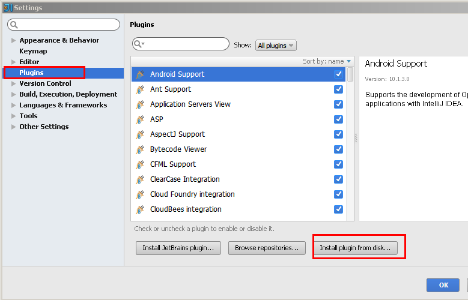
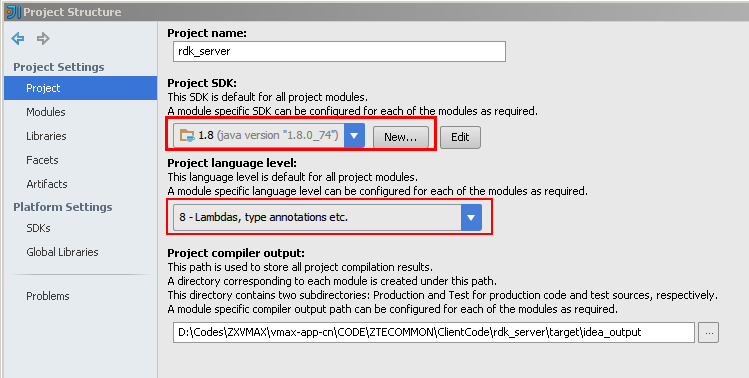
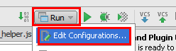
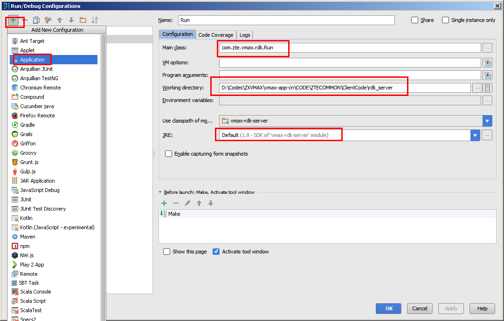
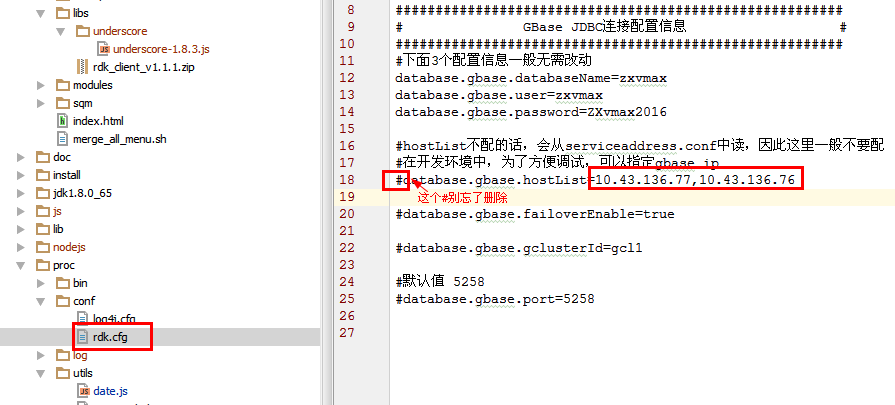
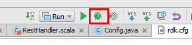

<rdk_title>如何断点调试Rest服务</rdk_title>

## 检出代码 ##

如果本地电脑上没有下面这个svn分支，请检出

	http://10.5.70.3/ZXVMAX/CODE/dev/ZXVMAX/vmax-app-cn/CODE/ZTECOMMON/ClientCode/

假设检出到本地的这个目录下

	d:\Codes\ZXVMAX\vmax-app-cn\CODE\ZTECOMMON\ClientCode

下文所有的目录都以这个为例，实际设置时，请务必修改为你的实际目录。

## 设置SBT运行环境 ##

打开一个windows的命令行终端，敲入一个sbt命令，如果报命令不存在，那请继续本小节的剩余部分。

如果sbt命令可以执行，则要确认你当前环境上的sbt，是不是对应着下面这个：

	d:\Codes\ZXVMAX\vmax-app-cn\CODE\ZTECOMMON\ClientCode\html\build\sbt

如果是，则跳过本小节。如果不是，则需要将环境上的sbt工具从系统环境变量中删除，再按照本小节余下过程设置。

把下面这个目录添加到Path环境变量中去

	d:\Codes\ZXVMAX\vmax-app-cn\CODE\ZTECOMMON\ClientCode\html\build\sbt\bin\

如果不知道怎么添加的话，请自行[百度](https://www.baidu.com/s?ie=utf-8&f=8&rsv_bp=0&rsv_idx=1&tn=baidu&wd=%E5%A6%82%E4%BD%95%E8%AE%BE%E7%BD%AE%E7%8E%AF%E5%A2%83%E5%8F%98%E9%87%8F&rsv_pq=fba32b1f000189c1&rsv_t=17cc7x9i2muEP6LU2zPYR3cF%2B04FWZNJ3geSW7MrqUEY3LgklGm0gBVIlM0&rsv_enter=1&rsv_sug3=24&rsv_sug1=10&rsv_sug7=100)。

完成之后，**一定一定**再打开一个命令终端继续余下的过程。

## 创建SBT工程 ##

打开一个新的命令终端，将当前目录切换到下面这个目录

	d:\Codes\ZXVMAX\vmax-app-cn\CODE\ZTECOMMON\ClientCode\rdk_server\

然后敲入sbt update命令：

	Microsoft Windows XP [版本 5.1.2600]
	(C) 版权所有 1985-2001 Microsoft Corp.
	
	D:\Codes\ZXVMAX\vmax-app-cn\CODE\ZTECOMMON\ClientCode\rdk_server>sbt update

敲回车执行，等待执行完毕，如果没有报错，则再敲入下面指令

	sbt gen-idea

## 安装 Idea IDE ##

必须要ultimate版的才行，[点击直接下载](http://10.9.233.35:8080/tools/ideaIU-15.zip)。

各种下一步后就装好了。

随后需要安装scala插件，如果不需要编辑代码可以跳过这一步。下载[这个插件](http://10.9.233.35:8080/tools/scala-intellij-bin-2.2.0.zip)，在Idea中选择菜单 File-> Settings 打开配置页，找到Plugins，单击 Install plugin from disk...，找到刚刚下载的scala插件，根据向导安装即可：

</img>

使用下面路径打开刚刚创建好的SBT工程

	d:\Codes\ZXVMAX\vmax-app-cn\CODE\ZTECOMMON\ClientCode\rdk_server\

打开之后，需要确认一下当前工程使用的jdk版本是否是1.8的，选择菜单 File-> Project Structure打开工程属性，在下图红框中要选择1.8，如果没有，则单击New新建一个1.8的jdk。

在刚刚检出的代码中有一个jdk1.8，路径是：

	d:\Codes\ZXVMAX\vmax-app-cn\CODE\ZTECOMMON\ClientCode\rdk_server\jdk1.8.0_65\

</img>

单击右上角，添加一个执行配置项：

</img>

新建一个执行配置：

</img>

红框中的要填正确，完成之后，OK关闭对话框。找到工程视图下的rdk.cfg文件，编辑它，把要连接的数据库信息配置在这里：

</img>

至此，终于可以在本地启动rdk服务了，单击右上角的这个按钮：

</img>

打开浏览器，输入

	http://localhost:5812/rdk/service

如果看到网页上显示下面的文字，表示一切正常

	Request is missing required query parameter 'p'

## 调试服务 ##

打开任意一个服务，单击行号附近空白位置可以添加一个断点，然后使用[前面的方法](/doc/manual.md#debug)启动一个服务的调试，注意把ip换成localhost。

正常的话，系统运行到断点处就会停下来，可以单步跟踪了。

